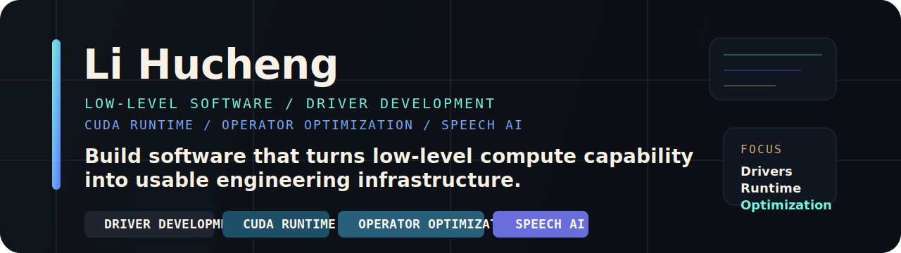

<p align="center">
  
</p>

<p align="center"><strong>Low-level Software / Driver Development / CUDA / Speech AI</strong></p>

<p align="center">
  I build low-level software and driver-facing compute infrastructure with a focus on CUDA runtime usability, operator performance, and engineering-ready systems work.
</p>
<p align="center">
  我主要做底层软件和驱动开发，重点放在 CUDA Runtime、算子优化，以及能真正落地到开发者工作流里的系统能力。
</p>

<p align="center">
  
  
  
  
</p>

## Education

**Hunan University**  
AI Graduate Study, 2025-present  
湖南大学，人工智能方向硕士阶段学习

## Featured Project

### CUDA Runtime & Operator Optimization

Built and refined a CUDA-like software stack around runtime interfaces, device-side coordination, and operator-side performance work.  
围绕 CUDA 风格的软件栈，持续做运行时接口、设备协同和算子性能优化相关工作。

- Worked on runtime-facing interfaces that make low-level compute capabilities easier to expose to upper-layer developers.
- 参与运行时接口设计与实现，让底层算力能力能以更稳定、更易用的方式提供给上层开发者。
- Built and debugged low-level software paths close to the driver boundary, covering device control, resource coordination, and engineering-facing integration details.
- 参与靠近驱动边界的底层软件路径开发与调试，覆盖设备控制、资源协同以及面向工程落地的接口衔接。
- Built control and resource-management paths for device interaction, including mechanisms similar to `ioctl`, event synchronization, and library-side abstractions.
- 覆盖设备控制、资源访问、事件机制和库函数封装等关键路径，减少上层使用成本。
- Focused on operator optimization with a SIMT-style execution model, especially around parallel partitioning, reducing synchronization overhead, and balancing compute with data movement.
- 在算子优化上重点处理并行切分、同步开销、访存与计算平衡，面向实际性能收益而不是纸面指标。
- Connected runtime work with system-facing infrastructure so the stack is not just runnable, but usable for later algorithm migration and engineering iteration.
- 这部分工作的目标不是只把程序跑起来，而是把整套基础设施做成后续算法迁移和工程迭代真正能用的底座。

## Research

### AudioBias-Bench / Speech AI Research

Participated in bias evaluation research for speech-centric large models through benchmark and dataset construction.  
参与语音大模型偏见评测相关研究，主要工作集中在 benchmark 与数据集建设。

- Contributed to **AudioBias-Bench** and the **ECHO 22K** dataset for social-bias evaluation in speech-centric models.
- 参与构建 **AudioBias-Bench** 与 **ECHO 22K**，用于语音中心大模型的社会偏见评测。
- Designed tasks spanning speech recognition and generation, then analyzed how different models behave across demographic dimensions.
- 设计覆盖识别与生成的评测任务，并分析不同模型在多类人群维度上的表现差异。
- Explored debiasing ideas inspired by Chain-of-Thought style reasoning and examined their tradeoffs against baseline model performance.
- 探索基于思维链风格推理的去偏置方法，并关注其与基础性能之间的权衡。

## Focus

```text
C / C++ / Low-level Software / Driver Development
CUDA Runtime / Operator Optimization / SIMT / Parallel Execution
Speech AI Evaluation / Benchmark Design / Model Analysis
```

## Contact

- Email: [lihucheng0330@163.com](mailto:lihucheng0330@163.com)
- Location: Changsha, Hunan, China
